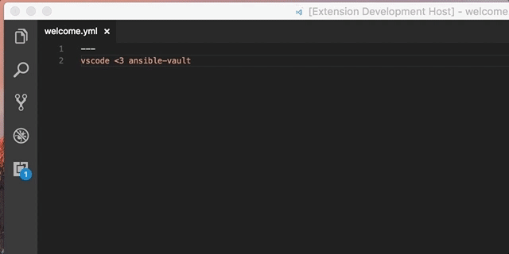

# VSCode ansible-vault extension

VSCode extensions to encrypt/decrypt ansible-vault file

Can toggle with <kbd>ctrl+alt+0</kbd>

_inspired by https://github.com/sydro/atom-ansible-vault_

## Requirements

- Ansible

## Extension Settings

This extension contributes the following settings:

* `ansibleVault.executable`: Full path of ansible-vault executable (e.g. `/usr/local/bin/ansible-vault`)
* `ansibleVault.keypass`: Ansible-vault password text (e.g. `GT6rAP7rxYzeFC1KtHVW`)
* `ansibleVault.keyfile`: Ansible-vault password file path (e.g. `~/.vault-pass.txt`)
